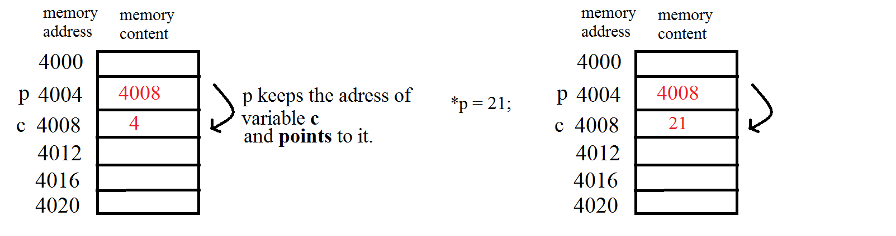

# Week 8 Notes - 13.11.2019

## Functions

https://www.geeksforgeeks.org/functions-in-c/

### Nedir
* Kod parcalarinin toparlanip isim verilmis hali.
* A function is a set of statements that take inputs, do some specific computation and produces output.
* The idea is to put some commonly or repeatedly done task together and make a function so that instead of writing the same code again and again for different inputs, we can call the function.

### Why Functions

#### Reusability
* Functions help us in reducing code redundancy. 
* If functionality is performed at multiple places in software, then rather than writing the same code, again and again, we create a function and call it everywhere.
* This also helps in maintenance as we have to change at one place if we make future changes to the functionality.

#### Abstraction
* In order to use a particular function you need to know the following things: 
  * The name of the function
  * What the function does
  * What arguments you must give to the function
  * What kind of result the function returns
**But notice:** If you just want to use the function in your program, you don't have to know how it works inside! 

#### Style and Modular
* Functions make code modular. Consider a big file having many lines of codes. It becomes really simple to read and use the code if the code is divided into functions.


### Function Declaration

```c
return_type function_name  (parameter_list) {
	local_variable_definitions
	statement(s)    
}
```


#### We will cover functions in the following order:
* Void functions
* Functions without parameters
* Functions with parameters
* Functions that return a value
* Functions that alter their parameters


## Scopes

* Typically there are three types of variables:
  * Local variables (also called as automatic variables in C)
  * Global variables
  * Static variables


* Memory is divided into four segments: code, data(uninitialized(bss) and initialized), heap, stack
  * global and static variables -------> data 
  * local variables(declared and defined in functions) --------> stack
  * dynamically allocated space --------> heap


* Data kutusu icinde global degiskenler var, bunlar yok olmuyor

* Her fonksiyon olusturulunca da,
  * Stack kutusu icinde yeni fonksiyon kutulari aciliyor.
  * Fonksiyon bitince bu kutu yok ediliyo.
  * Program bir degisken ararken once en icteki kutudan aramaya basliyo.


**Scope of Varibles**

```c
#include <stdio.h>
 
/* function declaration */
void swap(int a, int b);

/* function definition to swap the values */
void swap(int a, int b) {

   int temp;

   temp = a; /* save the value of a */
   a = b;    /* put b into a */
   b = temp; /* put temp into b */
  
   return;
}
 
int main () {

   /* local variable definition */
   int a = 100;
   int b = 200;
 
   printf("Before swap, value of a : %d\n", a );
   printf("Before swap, value of b : %d\n", b );
 
   /* calling a function to swap the values */
   swap(a, b);
 
   printf("After swap, value of a : %d\n", a );
   printf("After swap, value of b : %d\n", b );
 
   return 0;
}

```


<br />

### Question 1 - Up to the Heavens (LAB5 Q11)

Write power function which takes two integer numbers a and b, then calculates and returns a^b.

Then write main() appropriately to see the result.

|  INPUT  |  OUTPUT |
|:-------:|:-------:|
| 5 4 | 625 |
| 2 20 | 1048576 |

<br />

### Question 2 - Char Up (LAB5 Q2)

Write a function named toUpper which takes a char as input, and returns the upper case version of the character if it is a lower case letter. Otherwise it should return the same character.

Then write a program which reads a word from the user, and prints it with upper case characters. Assume valid words will be given. 

Write 3 different version:
1. void function
2. char return

|  INPUT  |  OUTPUT |
|:-------:|:-------:|
| bogazici | BOGAZICI |
| CmpE | CMPE |

<br />


### Question 3 - Am I a Prime to You (LAB5 Q14)

Write a function named 'isPrime' that takes an integer as a parameter and returns 1 if the number is prime, otherwise returns 0.
* (These 0 (false) or 1 (true) returning functions are also known as "boolean functions")

Then write main appropriately to see the result.  

|  INPUT  |  OUTPUT |
|:-------:|:-------:|
| 17 | 1 |
| 345 | 0 |
| 1 | 0 |

<br />


### Question 4 - Am I TWO Prime to You

Example to check if an integer (entered by the user) can be expressed as the sum of two prime numbers of all possible combinations with the use of functions. 

* NOTE: You can use "isPrime" function you wrote previously.

|  INPUT  |  OUTPUT |
|:-------:|:-------:|
| 34 | 3 31<br>5 29<br>11 23<br>17 17 |


<br />

## Call by Reference - Pointers

* We want to change the value of variable inside function.

* We pass a reference to the parameter





```c
#include <stdio.h>

void increment(int z)
{
  (z)++;
  printf("In increment function: %d\n", z);
}

void incrementRef(int *zPtr)
{
  (*zPtr)++;
  printf("In incrementRef function: %d\n", *zPtr);
}

int main()
{
  int a = 1;
  printf("%d\n", a);
  increment(a);
  printf("%d\n", a);
  incrementRef(&a);
  printf("%d\n", a);
  return 0;
}
```

