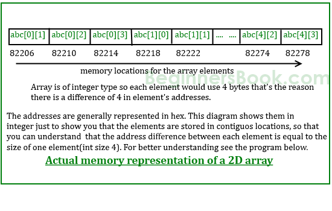

# Week 11 Notes - 04.12.2019

### Question 1 - Array to Func

Write the following functions
* read_array: Takes two parameters, an int array and its size. Then reads the elements of the array.
* print_array: Takes two parameters, an int array and its size. Then prints the elements of the array.
* copy_arrays: Takes three parameters, two int array with the same size and their size. Then copies the elements of the second array to the first array.


### What arrays actually are? (Hint: Pointers)

```c
#include <stdio.h>

int main()
{
    int x = 10;
    int *xPtr = &x;
    printf("&xPtr: %p, &x: %p, xPtr: %p, xPtr+1: %p\n\n", &xPtr, &x, xPtr, xPtr+1);
    
    int arr[10] = {1,2,3};
    char arr2[10] = {'a', 'b', 'c'};
    printf("&arr: %p, &arr[0]: %p, arr: %p, arr+1: %p\n", &arr, &arr[0], arr, arr+1);
    printf("arr[0]: %d, *arr: %d, *(arr+1): %d\n\n", arr[0], *arr, *(arr+1));
    printf("&arr2: %p, &arr2[0]: %p, arr2: %p, arr2+1: %p\n", &arr2, &arr2[0], arr2, arr2+1);
    printf("arr2[0]: %c, *arr2: %c, *(arr2+1): %c\n", arr2[0], *arr2, *(arr2+1));
    
    return 0;
}
```


## Multi Dimensional Arrays

```c
float x[10];

int c[3] = {-1, 5, 9};
         
int c[] = {-1, 5, 9};
```

<br>


<br>

```c
float x[3][4];

int c[2][3] = {{1, 3, 0}, {-1, 5, 9}};

int y[2][3][4] = {
    {{3, 4, 2, 3}, {0, -3, 9, 11}, {23, 12, 23, 2}},
    {{13, 4, 56, 3}, {5, 9, 3, 5}, {3, 1, 4, 9}}};
```
<br>




<br>

```c
float x[3][4];

int c[2][3] = {{1, 3, 0}, {-1, 5, 9}};
         
int c[][3] = {{1, 3, 0}, {-1, 5, 9}};
                
int c[2][3] = {1, 3, 0, -1, 5, 9};
```

<br>

### Question 2 - EM DI EY

Write a program which reads dimensions of a 2D int array. Then read elements of the array row by row and store it and then print. (Assume max dimensions < 100)

```
Input         Output
2 4           1 2 3 4
1 2 3 4       5 6 7 8
5 6 7 8
```

<br>

### Question 2.5 - EM DI EY to the function

* First dimension can be empty, other dimensions should be filled with constant int or constants. Variables are compatible only with C99
* https://www.geeksforgeeks.org/pass-2d-array-parameter-c/
* https://stackoverflow.com/questions/3911400/how-to-pass-2d-array-matrix-in-a-function-in-c
* The reason first dimension is required is because the computer needs to know how far along to increment the pointer for each "row". Really, all dimensions except the first one are necessary. C stores arrays as chunks of memory, with no delimiters. (https://stackoverflow.com/questions/3911400/how-to-pass-2d-array-matrix-in-a-function-in-c#comment4169805_3911409)

<br>

### Question 3 - Swap Columns

Given a R x C matrix, the task is to interchange the elements of first and last columns and show the resulting matrix.

```
Input         Output
8 9 7 6       6 9 7 8
4 7 6 5       5 7 6 4
3 2 1 8       8 2 1 3
9 9 7 7       7 9 7 9

Input         Output
9 7 5 1       1 7 5 9
2 3 4 1       1 3 4 2
5 6 6 5       5 6 6 5
1 2 3 1       1 2 3 1
``` 

<br>

### Question 4 - Lower Triangle

Given a square matrix size N, the task is sum right lower triangle.

```
Input         Output
8 9 7 6       60
4 7 6 5       
3 2 1 8       
9 9 7 7       

Input         Output
9 7 5         29
2 3 4         
5 6 6         
``` 