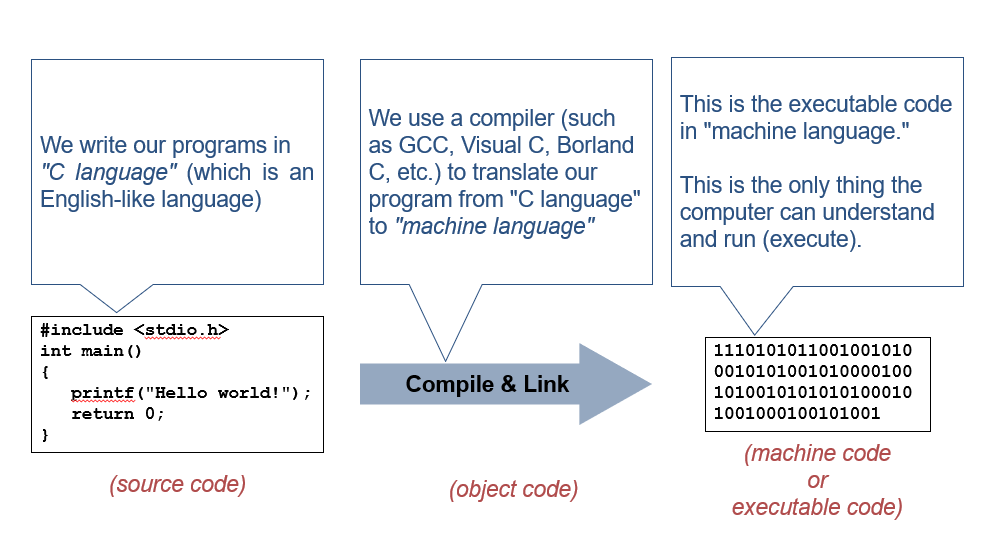
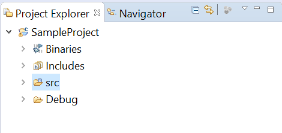
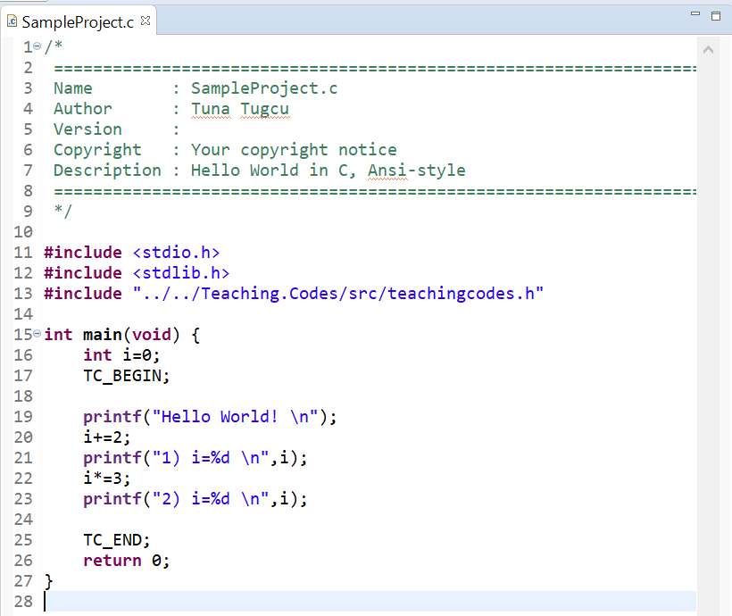
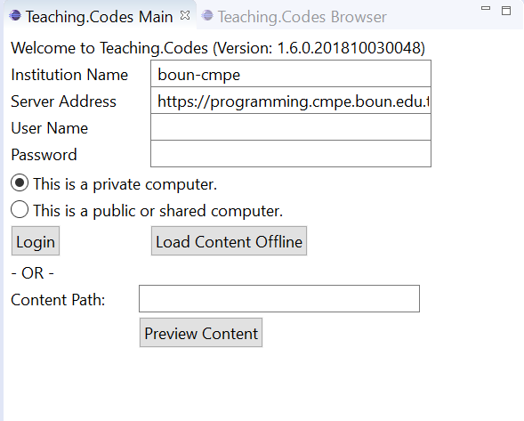
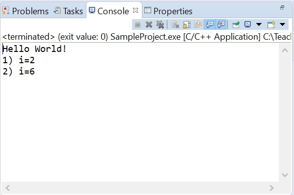

# Welcome to CMPE150.03 Lab Session! -- (Lab 1 - 12.02.2020)


### Assistant:	**Burak Suyunu**

### Mail:		**burak.suyunu@boun.edu.tr**

### Office:	    **BM 17B**


## Important Announcements

* You will be added to an email list for the announcements after the add/drop period. **Make sure that your e-mail in BUIS is valid!**

* We will use **Eclipse IDE** and **Teaching Codes** plug-in in labs and exams.  Student accounts will be created for this plug-in. The username and password will be sent to **the e-mail in BUIS**.

* There will be **weekly pop-up quizzes** during lab hours.  The quiz grades **contribute** to the overall grade.  *(10%)*

* Everyone must attend to the lab session of **the section registered to**.  If you have any conflict, you should change your section. 

* You should complete the installation as soon as possible after we send the manual. 

* Labs hours are dedicated to **practical programming exercises not for covering lecture materials**. I **strongly** suggest you to attend the lectures. 

* **Grading**
    * Quizes: %10
    * Midterm 1 (31.03.2020): %25 
    * Midterm 2 (05.05.2020): %30
    * Final (TBA): %35
    
* Lecture Notes: https://www.dropbox.com/sh/necfl3mqdkecmyd/AAArCAWBiFA7HhDJyZhc9jqea?dl=0

* github link: https://github.com/suyunu/c-notes

# Programming Languages


Figure from: https://www.ubuntupit.com/wp-content/uploads/2018/11/Most-Popular-Programming-Languages.jpg




 

## Installation

The installation consists of four stages. The steps you should follow for these stages are OS dependent (Windows, Linux, MacOS). 

* **Stage #0:** https://programming.cmpe.boun.edu.tr/
* **Stage #1:** *Install Java 8u181 JDK*
* **Stage #2:** *Installing the C Compiler*
* **Stage #3:** *Download and Install the ZIP File*
* **Stage #4:** *Run Eclipse and Set Your Workspace*


## Eclipse IDE

### What's an IDE? 

An integrated development environment (**IDE**) is a software application that provides comprehensive facilities to computer programmers for software development. An **IDE** normally consists of at least a source code editor, build automation tools, and a debugger. (Definition from https://en.wikipedia.org/wiki/Integrated_development_environment)

### Eclipse is an open source integrated development environment. 

It provides tools for *writing code, compiling and building the program and debugging.*


## User Interface 


* Project Explorer

  

  

  

  

  

* Code Editor

  

  

  

  

* Teaching Codes Plug-in

  

  

  

  

* Console

  

  

  

  

* Toolbar

  

  
  
  
  
  

 **If you closed any of these views accidentally, you can open them following *Window>Show View> (View Name) (i.e. Console, Project Explorer, Other for Teaching Codes)* **


### Creating a New Project and Running

* Click **New** Under **File**.
* Choose **C/C++ Project**. 
* Choose **C Managed Builds**. 
* Give your project a *name* and click **Finish**. 
* To build and run your project for the first time, you should right click on the project on *Project Explorer*. 
* Click **Build Project** from the options.
* After you see *Build Finished* message on the *Console*, right click on the project again. 
* Click **Run as Local C/C++ Application**.  
* After first building and running, you could use the **build** and **run** buttons on the *Toolbar*. 

## Main Function 

* This function is "called" by the operating system when the program runs. Thus it is the first code executed when a program starts. 
* Statements are executed in sequential order.

* **return 0;**  terminates the main() function and returns the value 0 meaning that the program runned successfully.

## Comments

* Multiline comments: /* */

* Single line comments:  //

## Code Block 

* The set of statements between a pair of braces is called a *block*.

* Each statement must end with a semicolon (;)

## Variables

* Storing value for later use
* Variable names: only letters (English), digits, and underscore ( _ ). cannot start with a digit. Case sensitive.

## Declarations

* In C, every variable needs to be *declared* to be a specific type before use. (i.e. int sum;)
* Several variables of the same type can be declared in a single line. Names separated with comma. (int num1, num2, num3;)

## Assignments (=)

* Stores a value at the memory location reserved for the variable. **Not mathematical equality.**

## Operations 

* Sum, Subtraction, Multiplication, Division, Modulus. 

## Conventions

* Write one statement per line
* Indent the code inside a block (press Tab).
* Blocks inside blocks should be further indented.
* Use spaces on both sides of operators.
* Use a lot of comments.
* Use meaningful variable names.

## Output

* The #include directive copies the contents of a “header file” into source code.
* stdio.h: The header file for the standard input-output library.
* Required for the printf() function.
* #include <stdio.h>

### printf() 

* printf(“Result= %d\n”, number_3);
* Takes a “format string”, and any number of expressions. Expression: Anything that returns a value.
* %d: “Format specifier”, used for int.
* \n: Newline character (one of the “escape” characters)
* printf(“%d + %d = %d\n”, number_1, number_2, number_3);**


---
page credit to https://github.com/gokceuludogan/cmpe150-fall19


---

## Examples

### Example 1 - Hello World

<details>
<summary>Code 1</summary>
    
<br>

```c
#include <stdio.h>

int main()
{
    printf("Hello World");

    return 0;
}
```
</details>

<br>
    
### Example 2 - Let's TryAngle

<details>
<summary>Code 2</summary>
    
<br>
    
```c
#include <stdio.h>

int main()
{
    printf("*\n");
    printf("**\n");
    printf("***\n");
    printf("****\n");

    return 0;
}
```
    
</details>
    
<br>

### Example 3 - Numbers and Characters

<details>
<summary>Code 3</summary>
    
<br>
    
```c
#include <stdio.h>

int main()
{
    printf("2 + 3 = %d", 2 + 3);

    return 0;
}
```
    
</details>

<br>

### Example 4 - Hold Me Variable

<details>
<summary>Code 4</summary>
    
<br>
    
```c
#include <stdio.h>

int main()
{
    int number;
    
    number = 10;
    
    printf("number = %d", number);

    return 0;
}
```
    
</details>
    
    
<br>

### Example 5 - Read Me Variable

<details>
<summary>Code 5</summary>
    
<br>
    
```c
#include <stdio.h>

int main()
{
    int number;
    
    scanf("%d", &number);
    
    printf("number = %d", number);

    return 0;
}
```
    
</details>
    
<br>    

### Example 6 - Calculate Us Variables

<details>
<summary>Code 6</summary>
    
<br>
    
```c
#include <stdio.h>

int main()
{
    int number1, number2;
    
    scanf("%d %d", &number1, &number2);
    
    printf("%d %d %d", number1+number2, number1*number2, number1/number2);

    return 0;
}

```
    
</details>