# Week 8 Notes - 22.04.2020

## Functions - Call by Reference - Pointers

### Function Syntax


<br>

### Swap - Call by Value (Scope of Variables)

```c
#include <stdio.h>
 
/* function declaration */
void swap(int a, int b);

/* function definition to swap the values */
void swap(int a, int b) {

   int temp;

   temp = a; /* save the value of a */
   a = b;    /* put b into a */
   b = temp; /* put temp into b */
}
 
int main () {

   /* local variable definition */
   int a = 100;
   int b = 200;
 
   printf("Before swap, value of a : %d\n", a );
   printf("Before swap, value of b : %d\n", b );
 
   /* calling a function to swap the values */
   swap(a, b);
 
   printf("After swap, value of a : %d\n", a );
   printf("After swap, value of b : %d\n", b );
 
   return 0;
}

```
<br>

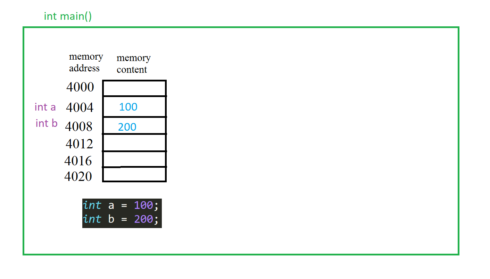

---

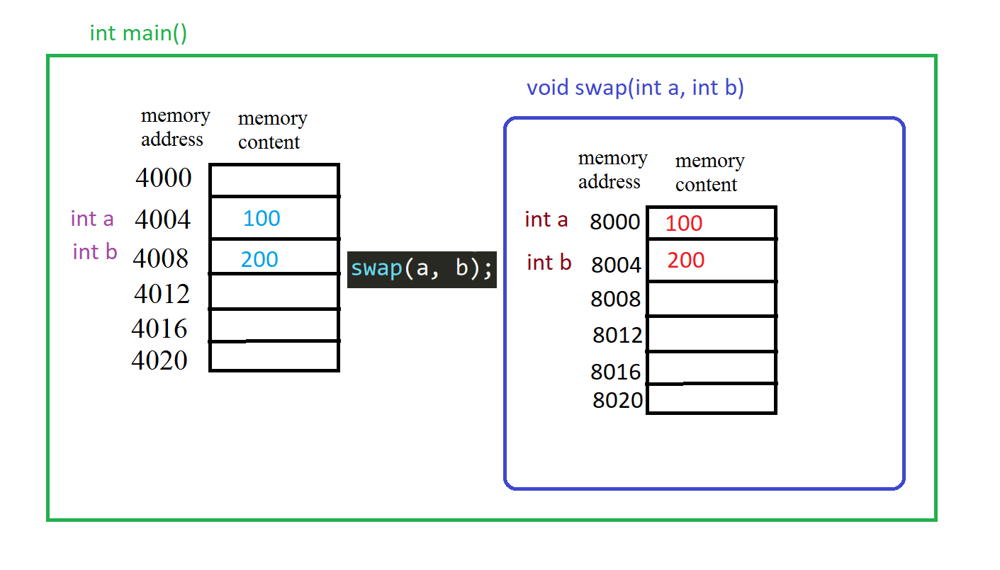

---

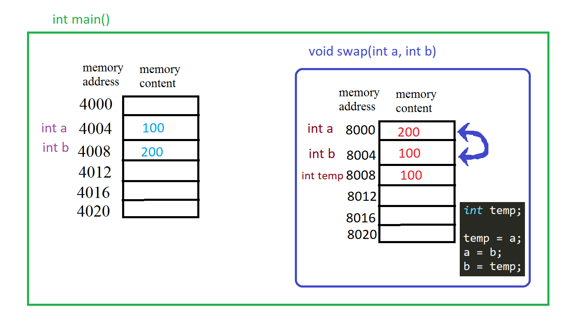

---

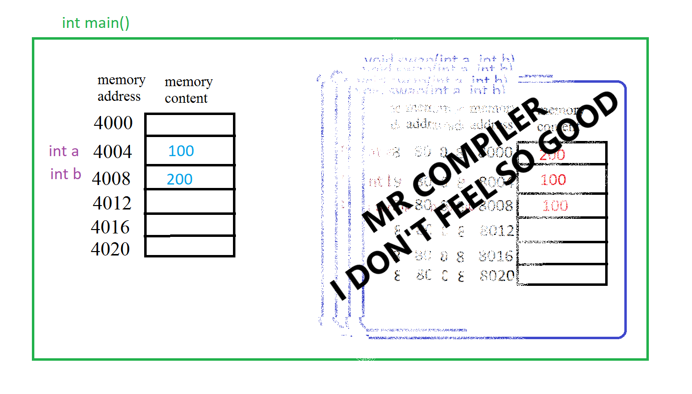

---


<br>

## Pointers

```c
#include <stdio.h>

int main () {
	int *p;
	int c;

	p = &c;
	c = 4;

	*p = 21;

	int d = 34;

	p = &d;

	printf("%d")

	return 0;
}

```

<br>

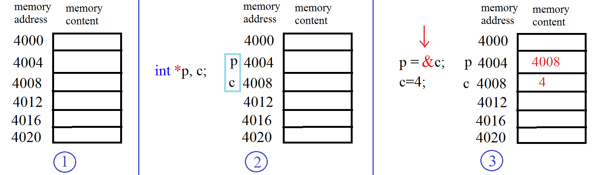

---

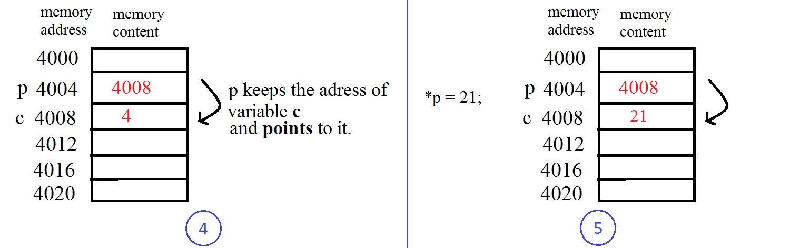

---


<br>

**Line by line outputs**
```c
#include <stdio.h>

int main () {
	int *p;
	int c;
	
	printf("int *p, c\n");
	printf("&p: %p  -  p: %p\n",&p ,p);
	printf("&c: %p  -  c: %d\n",&c ,c);
    printf("\n\n");

	p = &c;
	c = 4;
	
	printf("p = &c;\nc = 4;\n");
	printf("&p: %p  -  p: %p  -  *p: %d\n",&p ,p, *p);
	printf("&c: %p  -  c: %d\n",&c ,c);
    printf("\n\n");

	*p = 21;
	
	printf("*p = 21;\n");
	printf("&p: %p  -  p: %p  -  *p: %d\n",&p ,p, *p);
	printf("&c: %p  -  c: %d\n",&c ,c);
    printf("\n\n");

	int d = 34;
	
	p = &d;

    printf("int d = 34;\np = &d;\n");
	printf("&p: %p  -  p: %p  -  *p: %d\n",&p ,p, *p);
	printf("&c: %p  -  c: %d\n",&c ,c);
	printf("&d: %p  -  d: %d\n",&d ,d);

	return 0;
}
```

<br>

**Side note: Two different ways to define a pointer and then assing an address to it.**

```c
int n = 5;
int *p;
p = &n;
```

```c
int n = 5;
int *p = &n;
```
<br>

### Swap - Call by Reference

```c
#include <stdio.h>
 
/* function declaration */
void swap(int *a, int *b);

/* function definition to swap the values */
void swap(int *a, int *b) {
    int temp;

    temp = *a; /* save the value of *a */
    *a = *b;    /* put *b into *a */
    *b = temp; /* put temp into *b */
}
 
int main () {
    /* local variable definition */
    int a = 100;
    int b = 200;

    printf("Before swap, value of a : %d\n", a );
    printf("Before swap, value of b : %d\n", b );

    /* calling a function to swap the values */
    swap(&a, &b);

    printf("After swap, value of a : %d\n", a );
    printf("After swap, value of b : %d\n", b );

    return 0;
}

```

<br>


---

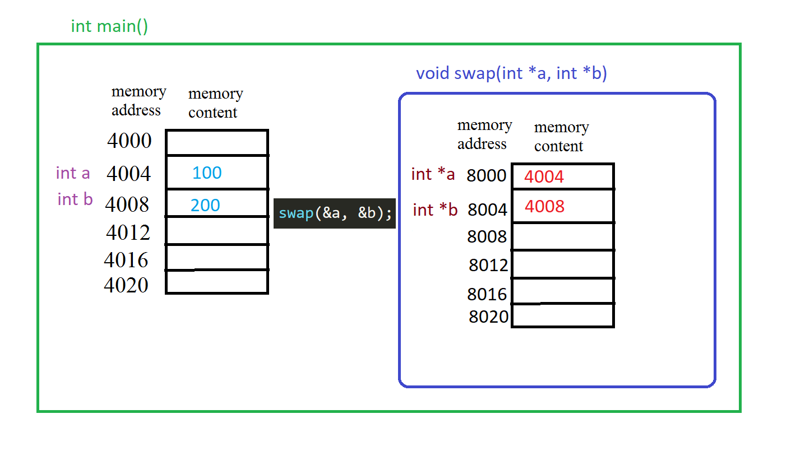

---

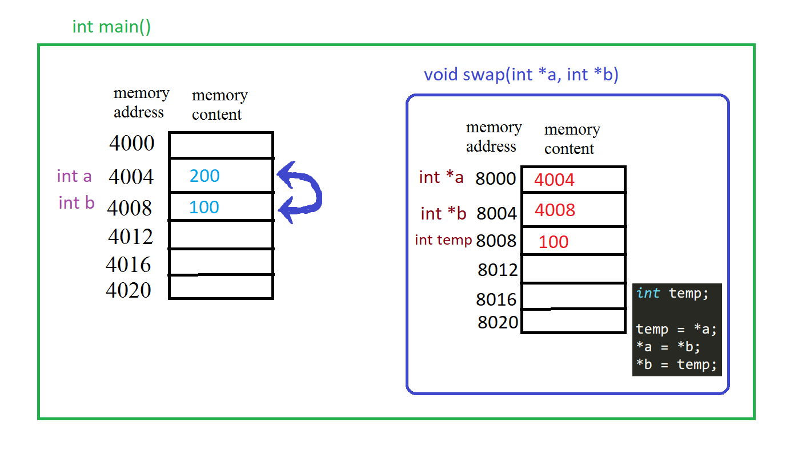

---

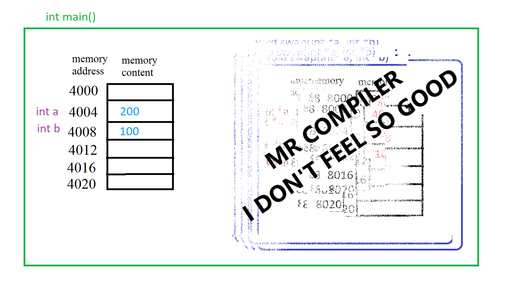

---

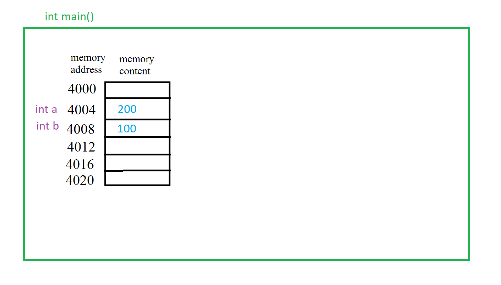

<br>

### Question 1 - Number Alteration

In the main function, one integer number and a char are read from the user into the variables x and c respectively. Complete the program by writing the function **alter**.

**alter** function takes one integer pointer (address of an integer) and one char variable as parameters. Function does the following operations:
* If char parameter is 'i', then increase the integer pointer parameter by one.
* If char parameter is 'd', then decrease the integer pointer parameter by one.
* If char parameter is 's', then assign the square of the integer pointer parameter to itself.
* Otherwise, do not change anything.

In the main function send variables x and c to the **alter** function and then print x in the main function.

|  INPUT  |  OUTPUT |
|:-------:|:-------:|
| 22 i | 23 |
| -4 d | -5 |
| 20 s | 400 |
| 20 j | 20 |

<br>

```c
#include <stdio.h>

// DO_NOT_EDIT_ANYTHING_ABOVE_THIS_LINE

// DO_NOT_EDIT_ANYTHING_BELOW_THIS_LINE

int main()
{
    int x;
    char c;
    
    scanf("%d %c", &x, &c);
    
    alter(
    // DO_NOT_EDIT_ANYTHING_ABOVE_THIS_LINE

    // DO_NOT_EDIT_ANYTHING_BELOW_THIS_LINE
        );
        
    printf("%d", x);
    return 0;
}
```

<br>

### Question 2 - Divide and Remain Still

Write a function named **divideWithRemainder** which takes two integer (number, divisor) and two integer pointer variables (\*result, \*remainder) as parameters:

This function should divide the **number** by **divisor**, then store the result in the parameter **\*result**, and store the remainder in the parameter **\*remainder**.

|  INPUT  |  OUTPUT |
|:-------:|:-------:|
| 8 3 | 2 2 |
| 27 4 | 6 3 |
| 10 2 | 5 0 |

<br>

```c
#include <stdio.h>

// DO_NOT_EDIT_ANYTHING_ABOVE_THIS_LINE

// DO_NOT_EDIT_ANYTHING_BELOW_THIS_LINE

int main()
{
    int n, d, res, rem;
    
    scanf("%d %d", &n, &d);
    
    divideWithRemainder(
    // DO_NOT_EDIT_ANYTHING_ABOVE_THIS_LINE

    // DO_NOT_EDIT_ANYTHING_BELOW_THIS_LINE
        );
        
    printf("%d %d", res, rem);
    return 0;
}
```

<br>

### Question 3 - Powered Sums

In the main function, two integer numbers are read from the user into the variables a and b respectively. Complete the program by writing two functions named **sums** and **powered**.

**sums** takes two integers (a and b) and an integer pointer (\*sum). The function should store the sum of these two integers in \*sum pointer.

**powered** takes three integers (sum, a and b) and two integer pointers (\*sum_p1 and \*sum_p2). The function should store the $a^{th}$ power of the sum in \*sum_p1 and $b^{th}$ power of the sum in \*sum_p2. 

Output:

First Line: Sum of two numbers

Second Line: $a^{th}$ power of the a+b and  $b^{th}$ power of the a+b

|  INPUT  |  OUTPUT |
|:-------:|:-------|
| 6 1 | 7<br>117649 7 |
| 4 4 | 8<br>4096 4096 |
| 5 0 | 5<br>3125 1 |

<br>

```c
#include <stdio.h>

// DO_NOT_EDIT_ANYTHING_ABOVE_THIS_LINE

// DO_NOT_EDIT_ANYTHING_BELOW_THIS_LINE

int main(){
	int a, b;
	scanf("%d %d",&a,&b);

	int sum;
	sums(
		// DO_NOT_EDIT_ANYTHING_ABOVE_THIS_LINE

		// DO_NOT_EDIT_ANYTHING_BELOW_THIS_LINE
	);
	printf("%d\n",sum);

	int sum_p1,sum_p2;
	powered(
		// DO_NOT_EDIT_ANYTHING_ABOVE_THIS_LINE

		// DO_NOT_EDIT_ANYTHING_BELOW_THIS_LINE);
	);
	printf("%d %d", sum_p1, sum_p2);

	TC_END;
    return 0;
}

```

<br>

### Question 4 - Complex Powers (Old Midterm Question)

* Think about how we write the regular power.

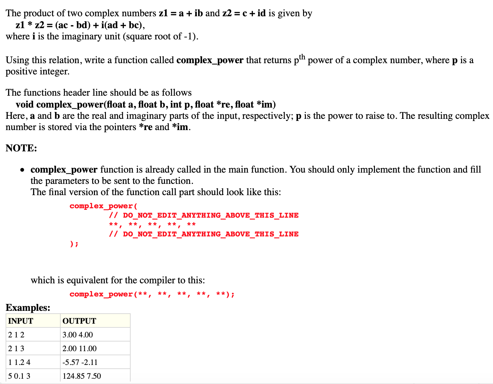
