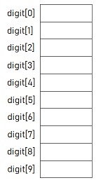
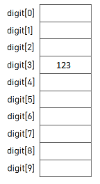
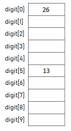
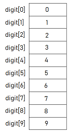
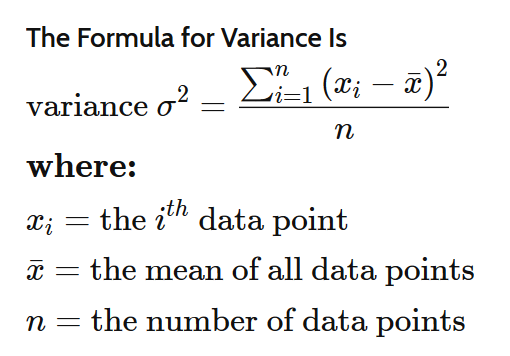

# Week 9 Notes - 29.04.2020

## Arrays

<details>

<summary> Brief Summary </summary>

<br>

* An array is a group of memory locations.
* These locations are related by the fact that they have all the same name and same type.
* We can define an array as follows:

   - type arrName[size];
   
     * Where, **type** is any data type like int, float etc. 
     * **arrName** is the name of the array variable.
     * The square brackets contains an integer value **size**. It is the total number of values we can store in the array variable.
     
* In order to access to a particular location, i.e., an element within the array, we specify the name of the array and the position number (index) of the variable in square brackets.
   

### Example: 

* We want to create an array named digit of size 10 and type as int.

```c 
#include <stdio.h>

int main()
{
    int digit[10];

    return 0;
}
```

* The above code allocates memory space for 10 integer data values. But be aware of that, these elements are not initialized, so that we don't know their values.



* We can assign values directly to each element of the array:

<br>

```c 
#include <stdio.h>

int main()
{
    int digit[10];

    digit[3] = 123;

    return 0;
}
```



<br>

* We can read values from the user and store them in the array:

```c 
#include <stdio.h>

int main()
{
    int digit[10];

    scanf("%d", &digit[5]); // Assume user enters 13
    digit[0] = digit[5] * 2;

    return 0;
}
```



<br>

* Now, let's initialize our digit array with digits from 0 to 9 to:

```c 
#include <stdio.h>

int main()
{
    int digit[10] = {0,1,2,3,4,5,6,7,8,9};

    return 0;
}
```



<br>

* What if we don't initialize all the elements of the array:

```c 
#include <stdio.h>

int main()
{
    int digit[10] = {0,1,2,3,4};

    return 0;
}
```

* Then the uninitialized elements will be automaticly initialized to 0 (zero).


<br>

* Now, let's assign digits from 0 to 9 to the corresponding locations in our digit array with a loop:

```c 
#include <stdio.h>

int main()
{
    int i;
    int digit[10];

    for(i = 0; i < 10; i++)
        digit[i] = i;

    return 0;
}
```


<br>

* We can assign values to an array form the user with a for loop:

```c 
#include <stdio.h>

int main()
{
    int i;
    int digit[10];

    for(i = 0; i < 10; i++)
        scanf("%d", &digit[i]); // Assume the user enters 1 3 5 7 9 11 13 15 17 19

    return 0;
}
```


* You can also create a Variable Length Array (VLA), using an integer variable for the size.
* However, you can not initialize a VLA when declaring.
* Even though VLA's are supported from C99, there are compilers that are not compatible with VLA's.

```c 
#include <stdio.h>

int main()
{
    int n = 10;
    int digit[n];

    return 0;
}
```

* The above code allocates memory space for 10 (value of variable n) integer data values. But again be aware of that, these elements are not initialized, so that we don't know their values.


<br>

**THINK ABOUT**: What are the ways to initialize an array with 0's (zeros).

</details>

<br>

## Questions

## Question 1 - Large

Write a program that reads an integer N from the user, then reads N more integers from the user and store them in an array. Then prints elements larger than the average of numbers held in the array. 

| Input                          | Output     |
| ------------------------------ | ---------- |
| 10  <br>1 2 3 4 5 6 7 8 9 10 | 6 7 8 9 10 |
| 4 <br>4 1 3 8                | 8          |

<br>

## Question 2 - Statistics

Write a program that reads an integer N from the user, then reads N more integers from the user and store them in an array. Then prints the sum, average and variance of the elements.




| Input                         | Output      |
| ----------------------------- | ----------- |
| 10 <br />1 2 3 4 5 6 7 8 9 10 | 55 5.50 8.25|
| 4<br />4 1 3 8                | 16 4.00 6.5|

<br>

## Question 3 - Encryption (Teaching Codes Lab7)

Write a program which reads a sentence from the user (read characters until '\n' appears). Your program then should put this sentence into a char array (assume the sentence will be shorter than 50 characters).

Then, encrypt this sentence by adding +1 to the value of each character and print the encrypted version of the char array to the screen.

Then, decrypt this sentence by adding -1 to each character, and print the decrypted version of the char array to the screen.

| Input          | Output                            |
| -------------- | --------------------------------- |
| Hello Bogazici | Ifmmp!Cphb{jdj<br/>Hello Bogazici |
| Stay at home   | Tubz!bu!ipnf<br/>Stay at home     |


<br>

## Question 4 - Reverse (Teaching Codes Lab7)

Write a program which reads an integer N from the user, then reads N integers from the user and store them in an array (Assume N is smaller than 50).

**a**. Then print them to the screen in reverse order.

**b.** Then reverse the order of these integers in the array and print the array. 

| Input                 | Output         |
| --------------------- | -------------- |
| 5<br>3 1 -4 5 2     | 2 5 -4 1 3     |
| 6<br>15 7 2 89 8 12 | 12 8 89 2 7 15 |

<br>

### Question 5 - Let's Count

Write a program which reads an integer N from the user, then reads N integers from the user to an array. Then find frequency of each element in the array. Assume N is smaller than 1000 and the entered numbers will be between 0 and 100 (inclusive).

|  INPUT  |  OUTPUT |
|-------|-------|
| 10<br>5 10 2 5 50 5 10 1 2 2 | 1 --> 1<br>2 --> 3<br>5 --> 3<br>10 --> 2<br>50 --> 1 |

<br>

## Question 6 - Inception (Teaching Codes Lab7)

Write a program which reads two integers: N and M from the user. Then the program should read N more integers, then M more integers from the user. Assume N < M < 50.

If the first combination of N integers appears at least once in the second combination of M integers, the program should write the starting index of the first appearance in the second combination. Otherwise it should not print anything.

| Input                                          | Output |
| ---------------------------------------------- | ------ |
| 4 12<br/>4 5 6 5<br/>1 2 1 2 99 99 4 5 6 5 9 9 | 6      |
| 3 5<br/>2 2 2<br/>1 2 2 2 2 5                  | 1      |
| 3 5<br/>2 3 2<br/>1 2 2 2 5                    |        |

<br>

### Question 7 - Pairs

Write a program which reads an integer N and an integer X from the user, then reads N integers from the user to an array. Then find all pairs in the array whose sum is equal to X. 

* A number can not be a pair with itself. Pairs should consist of different numbers.
* You can print either (3,4) or (4,3) for one pair.
* You should print all the pairs even if they are same.

|  INPUT  |  OUTPUT |
|-------|-------|
| 7 7<br>2 4 3 5 7 8 9 | (2, 5)<br>(4, 3) |
| 10 7<br>2 4 3 5 6 -2 4 7 8 9 | (2, 5)<br>(4, 3)<br>(3, 4)<br>(-2, 9) |


<br>

### Question 8 - fix34

Write a program which reads an integer N from the user, then reads N integers from the user to an array. Then rearrange the array so that every 3 is immeddiately followed by a 4. Do not move the 3's, but every other number may move. The array contains the same number of 3's and 4's, every 3 has number after it that is not a 3, and a 3 appears in the array before any 4.

|  INPUT  |  OUTPUT |
|-------|-------|
| 4<br>1 3 1 4 | 1 3 4 1 |
| 7<br>1 3 1 4 4 3 1 | 1 3 4 1 1 3 4 |
| 4<br>3 2 2 4 | 3 4 2 2 |

<br>

### Question 9 - Bubble Sort

Write a program which reads an integer N from the user, then reads N integers from the user to an array. Then sort elements of the array in ascending order. 

|  INPUT  |  OUTPUT |
|-------|-------|
| 8<br>4 2 8 6 7 3 1 5 | 1 2 3 4 5 6 7 8 |


Bubble Sort is the simplest sorting algorithm that works by repeatedly swapping the adjacent elements if they are in wrong order.

Example:

First Pass:
* ( **5** **1** 4 2 8 ) –> ( **1** **5** 4 2 8 ), Here, algorithm compares the first two elements, and swaps since 5 > 1.
* ( 1 **5** **4** 2 8 ) –> ( 1 **4** **5** 2 8 ), Swap since 5 > 4
* ( 1 4 **5** **2** 8 ) –> ( 1 4 **2** **5** 8 ), Swap since 5 > 2
* ( 1 4 2 **5** **8** ) –> ( 1 4 2 **5** **8** ), Now, since these elements are already in order (8 > 5), algorithm does not swap them.

Second Pass:
* ( **1** **4** 2 5 8 ) –> ( **1** **4** 2 5 8 )
* ( 1 **4** **2** 5 8 ) –> ( 1 **2** **4** 5 8 ), Swap since 4 > 2
* ( 1 2 **4** **5** 8 ) –> ( 1 2 **4** **5** 8 )
* ( 1 2 4 **5** **8** ) –> ( 1 2 4 **5** **8** )

Now, the array is already sorted, but our algorithm does not know if it is completed. The algorithm needs one whole pass without any swap to know it is sorted.

Third Pass:
* ( **1** **2** 4 5 8 ) –> ( **1** **2** 4 5 8 )
* ( 1 **2** **4** 5 8 ) –> ( 1 **2** **4** 5 8 )
* ( 1 2 **4** **5** 8 ) –> ( 1 2 **4** **5** 8 )
* ( 1 2 4 **5** **8** ) –> ( 1 2 4 **5** **8** )

