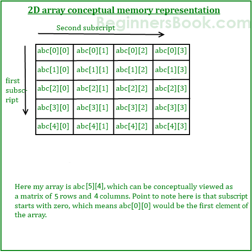
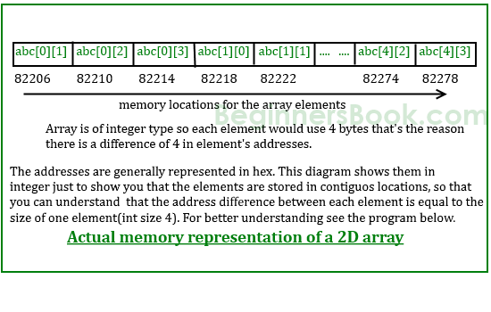

# Week 10 Notes - 06.05.2020

## A Brief Summary of Arrays (Continued)
<details>

<summary> Using Arrays with Functions </summary>

<br>

* Arrays are always *passed by reference* to a function.
   - Remember: the name of an array (let's say arrName) is actually equivalent to the address of the first element of the array, i.e., 
    arrName is equal to &arrName[0]
    
* Three ways of passing an array to a function:

   - (1) as a pointer,
   
   - (2) as a sized array,
   
   - (3) as an unsized array.
   
* Actually, these three methods all imply the same thing. Let's give an example to each method:

### Example 1: Passing array as a pointer:

```c 
#include <stdio.h>

void printArray(int *arr, int len)
{
    int i;
   for(i = 0; i < len; i++)
   {
      printf("%d ",*arr);
      arr++;
   }
}
int main()
{
    int myArr[5] = {1, 5, 6, 2, 2};
    
    printArray(myArr, 5);

    return 0;
}
```
The output will be:
1 5 6 2 2 

* Printing the elements of the array with the following way is also valid:

```c 
#include <stdio.h>

void printArray(int *arr, int len)
{
    int i;
   for(i = 0; i < len; i++)
   {
      printf("%d ", arr[i]);
   }
}
```

### Example 2: Passing array as a sized array:

```c 
#include <stdio.h>

void printArray(int arr[5], int len)
{
    int i;
   for(i = 0; i < len; i++)
   {
      printf("%d ",arr[i]);
      
   }
}
int main()
{
    int myArr[5] = {1, 5, 6, 2, 2};
    
    printArray(myArr, 5);

    return 0;
}
```
The output will be:
1 5 6 2 2 

* Writing any other number inside the curly brackets in the function definition does not alter the result:


```c 
#include <stdio.h>

void printArray(int arr[2], int len)
{
    int i;
   for(i = 0; i < len; i++)
   {
      printf("%d ",arr[i]);
   
   }
}
int main()
{
    int myArr[5] = {1, 5, 6, 2, 2};
    
    printArray(myArr, 5);

    return 0;
}
```
The output will be:
1 5 6 2 2 

* This is because the compiler does not care the given size in the function definition.

### Example 3: Passing array as an unsized array:

```c 
#include <stdio.h>

void printArray(int arr[], int len)
{
    int i;
   for(i = 0; i < len; i++)
   {
      printf("%d ",arr[i]);
     
   }
}
int main()
{
    int myArr[5] = {1, 5, 6, 2, 2};
    
    printArray(myArr, 5);

    return 0;
}
```
The output again will be:
1 5 6 2 2 

## Returning an array from a function:

* In C, we cannot return an entire array directly from a function. However, we can return a pointer to an array by specifying the array's name without an index. Let's see an example:

### Example:

```c
#include <stdio.h>

int * doubleArray(int arr[], int len)
{
   int i;
   for(i = 0; i < len; i++)
   {
      arr[i] = arr[i]*2;
   }
   return arr;
}
int main()
{
    int arr[5] = {1, 5, 6, 2, 2};
    int * doubled;
    int i;
    
    doubled = doubleArray(arr, 5);
    
    for(i = 0; i < 5; i++)
    {
       printf("%d ",doubled[i]);
    }

    return 0;
}
```
* The output will be:
2 10 12 4 4 

* If we want to return a local array defined in the function, we have to define it as static. Let's look at the following two examples to understand the difference:

```c
#include <stdio.h>

int * getArray()
{
   int i;
   int arr[5];
   
   for(i = 0; i < 5; i++)
   {
      arr[i] = i+1;
   }
   return arr;
}
int main()
{
    int * arr;
   
    int i;
    
    arr = getArray();
    
    for(i = 0; i < 5; i++)
    {
       printf("%d ",arr[i]);
    }

    return 0;
}
```

* In the example above, we define a local array *arr* inside the function *getArray*, assign and then return it to the main function. When we run the program, we will get a warning saying:

 *warning: function returns address of local variable*
 
 * This is because it is illegal in C to return memory location that is allocated within a function. When we run this program, the output looks weird:

1 2 6277760 0 5

* In order to overcome this problem, we need to define the array as static inside the function:

```c
#include <stdio.h>

int * getArray()
{
   int i;
   static int arr[5];
   
   for(i = 0; i < 5; i++)
   {
      arr[i] = i+1;
   }
   return arr;
}
int main()
{
    int * arr;
   
    int i;
    
    arr = getArray();
    
    for(i = 0; i < 5; i++)
    {
       printf("%d ",arr[i]);
    }

    return 0;
}
```

* Now we get the desired output:

1 2 3 4 5


</details>

## A Brief Summary of Multidimensional Arrays

<details>

<summary> Multidimensional Arrays </summary>


    
* We will only consider the 2-dimensional arrays. 
* We can define a 2-dim array as follows:

  - type arrName[rowSize][columnSize];
   
     * Where, **type** is any data type like int, float etc. 
     * **arrName** is the name of the array variable.
     * **rowSize** is a number denoting the number of rows and **columnSize** denotes the number of columns in a 2-dimensional array.
    
<br>
    
### Memory Representation of Multidimensional Arrays




<br>
    
### Multidimensional Arrays Declarations

```c
float x[3][4];

int c[2][3] = {{1, 3, 0}, {-1, 5, 9}};

int y[2][3][4] = {
    {{3, 4, 2, 3}, {0, -3, 9, 11}, {23, 12, 23, 2}},
    {{13, 4, 56, 3}, {5, 9, 3, 5}, {3, 1, 4, 9}}};
         
int c[][3] = {{1, 3, 0}, {-1, 5, 9}};
                
int c[2][3] = {1, 3, 0, -1, 5, 9};
    
// To initialize every element to 0
int c[2][3] = {{0}};
```

<br>
     

### Example: 2-dim Array

```c
#include <stdio.h>
int main()
{
    int arr[3][5] = {{1,2,3,4,5},{6,7,8,9,10},{11,12,13,14,15}}; 
    // we can also initialize the array as follows: int arr[3][5] = {1,2,3,4,5,6,7,8,9,10,11,12,13,14,15};  
   
    int i,j;
    
    
    for(i = 0; i < 3; i++)
    {
        for(j = 0; j < 5; j++)
            printf("%d ",arr[i][j]);
        printf("\n");
    }

    return 0;
}
```
* The output will be:
       
    1 2 3 4 5 <br/>
    6 7 8 9 10 <br/>
    11 12 13 14 15
    
* Let's look inside the each element of the array:

    arr[0][0] : 1 <br/>
    arr[0][1] : 2<br/>
    .<br/>
    .<br/>
    .<br/>
    arr[1][3] : 9<br/>
    .<br/>
    .<br/>
    .<br/>
    arr[2][4] : 15<br/>


<br>


## Multidimensional Arrays with Functions

* When defining a function that takes a multidimensional array as an argument, we need to specify the size of each dimension other than the first one. 

### Example:

* The following example shows a function named *sumIndices* which takes a 2-dim array and the sizes of its dimensions as arguments, and then fills the array by assigning the element in the i'th row and the j'th column with the sum of i and j.

```c
#include <stdio.h>

void sumIndices(int arr[][5], int N, int M)
{
   int i, j;
   
   for(i = 0; i < N; i++)
   {
       for(j = 0; j < M; j++)
          arr[i][j] = i+j; 
   }
}
int main()
{
    int arr[3][5];
   
    int i,j;
    
    
    sumIndices(arr,3,5);
    
    for(i = 0; i < 3; i++)
    {
        for(j = 0; j < 5; j++)
            printf("%d ",arr[i][j]);
        printf("\n");
    }
    
    return 0;
}
```

The output will be:

0 1 2 3 4<br/>
1 2 3 4 5<br/>
2 3 4 5 6
    
<br>
    
If your multidimensional array is a variable length array, then you can take variable length multidimensional arrays as function parameters.
    
But you should also take the array sizes as parameters before the multidimensional array.
    
```c
#include <stdio.h>

// N and M must come before arr
void sumIndices(int N, int M, int arr[N][M])
{
   int i, j;
   
   for(i = 0; i < N; i++)
   {
       for(j = 0; j < M; j++)
          arr[i][j] = i+j; 
   }
}
```

</details>

## Questions

### Question 1 - Pairs (7th question from previous lab)

Write a program which reads an integer N and an integer X from the user, then reads N integers from the user to an array. Then find all pairs in the array whose sum is equal to X.

* A number can not be a pair with itself. Pairs should consist of different numbers.
* You can print either (3,4) or (4,3) for one pair.
* You should print all the pairs even if they are same.

|  INPUT  |  OUTPUT |
|-------|-------|
| 7 7<br>2 4 3 5 7 8 9 | (2, 5)<br>(4, 3) |
| 10 7<br>2 4 3 5 6 -2 4 7 8 9 | (2, 5)<br>(4, 3)<br>(3, 4)<br>(-2, 9) |


<br>

### Question 2 - fix34 (A modified version of the 8th question from previous lab)

Write a program which reads an integer N from the user, then reads N integers from the user to an array. Then rearrange the array so that every 3 is immeddiately followed by a 4. Do not move the 3's, but every other number may move. The array contains the same number of 3's and 4's, every 3 has number after it that is not a 3, and a 3 appears in the array before any 4. 

For this purpose, write a function called *swap* that takes an integer array, an integer that denotes the size of the array, and two integers k and l as arguments. The function is supposed to swap the k'th and l'th elements in the array.

|  INPUT  |  OUTPUT |
|-------|-------|
| 4<br>1 3 1 4 | 1 3 4 1 |
| 7<br>1 3 1 4 4 3 1 | 1 3 4 1 1 3 4 |
| 4<br>3 2 2 4 | 3 4 2 2 |

<br>

### Question 3 - Bubble Sort (A modified version of the 9th question from previous lab)

Write a program which reads an integer N from the user, then reads N integers from the user to an array. Then sort elements of the array in ascending order. *You may want to use the same swap function in the previous question.* 

|  INPUT  |  OUTPUT |
|-------|-------|
| 8<br>4 2 8 6 7 3 1 5 | 1 2 3 4 5 6 7 8 |


Bubble Sort is the simplest sorting algorithm that works by repeatedly swapping the adjacent elements if they are in wrong order.

Example:

First Pass:
* ( **5** **1** 4 2 8 ) –> ( **1** **5** 4 2 8 ), Here, algorithm compares the first two elements, and swaps since 5 > 1.
* ( 1 **5** **4** 2 8 ) –> ( 1 **4** **5** 2 8 ), Swap since 5 > 4
* ( 1 4 **5** **2** 8 ) –> ( 1 4 **2** **5** 8 ), Swap since 5 > 2
* ( 1 4 2 **5** **8** ) –> ( 1 4 2 **5** **8** ), Now, since these elements are already in order (8 > 5), algorithm does not swap them.

Second Pass:
* ( **1** **4** 2 5 8 ) –> ( **1** **4** 2 5 8 )
* ( 1 **4** **2** 5 8 ) –> ( 1 **2** **4** 5 8 ), Swap since 4 > 2
* ( 1 2 **4** **5** 8 ) –> ( 1 2 **4** **5** 8 )
* ( 1 2 4 **5** **8** ) –> ( 1 2 4 **5** **8** )

Now, the array is already sorted, but our algorithm does not know if it is completed. The algorithm needs one whole pass without any swap to know it is sorted.

Third Pass:
* ( **1** **2** 4 5 8 ) –> ( **1** **2** 4 5 8 )
* ( 1 **2** **4** 5 8 ) –> ( 1 **2** **4** 5 8 )
* ( 1 2 **4** **5** 8 ) –> ( 1 2 **4** **5** 8 )
* ( 1 2 4 **5** **8** ) –> ( 1 2 4 **5** **8** )

<br>

### Question 4 - Transpose of a Matrix

Write a program which reads two integers N, M, and a 2-dimensional array with size NxM from the user and prints its transpose.

|  INPUT  |  OUTPUT |
|-------|-------|
| 2 3 <br> 5 2 4<br>1 4 0 | 5 1<br>2 4<br>4 0|

<br>

### Question 5 - 2D Arrays with Functions

Write a function named **print_2d_array()** which takes the sizes of a 2-dimensional array and an array as parameters and prints it.

Write a function named **read_2d_array()** which takes the sizes of a 2-dimensional array and an array as parameters and reads its content from the user.

<br>

### Question 6 - Matrix Addition

Write a program that reads two integers N and M, and then reads two 2-dimensional integer arrays with the size NxM from the user. The program then performs the matrix addition on these two 2d arrays and prints the result.

|  INPUT  |  OUTPUT |
|-------|-------|
|2 4 <br><br> 1 1 1 2<br>1 2 3 4<br><br>6 6 6 5<br>6 5 4 3|7 7 7 7<br>7 7 7 7|

<br>

### Question 7 - Diagonal Sum

Write a program to find sum of left and right diagonals of a 2-dimensional array. The program should first read an integer N and then a 2d integer array of size NxN from the user.

|  INPUT  |  OUTPUT |
|-------|-------|
|3 <br> 1 6 10<br>5 2 3<br>6 80 6|The sum of the left diagonal: 9<br>The sum of the right diagonal: 18 |
