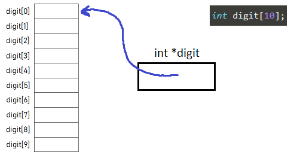

# Week 11 Notes - 13.05.2020
    
### Warm Up Question 1 - Rook and Pawns (Lab9 Q2)
Write a program which reads a chessboard as an 8x8 matrix from the user. In the chessboard, there will be one rook (kale) represented by integer: 8, and multiple pawns (piyonlar) represented by integer: 1. The rest will be empty: 0.

The rook will capture the closest possible pawn. Your program should print the chessboard to the screen after the capture. 

```
Input               Output
0 0 0 0 0 0 0 1     0 0 0 0 0 0 0 1
0 0 0 0 1 0 0 0     0 0 0 0 1 0 0 0
0 0 8 0 0 0 0 1     0 0 0 0 0 0 0 1
0 1 0 0 0 0 0 0     0 1 0 0 0 0 0 0
0 0 1 0 0 0 0 0     0 0 8 0 0 0 0 0
0 0 0 0 0 0 0 0     0 0 0 0 0 0 0 0
0 0 0 0 0 0 0 0     0 0 0 0 0 0 0 0
0 0 0 0 0 0 0 0     0 0 0 0 0 0 0 0
```
    
## Strings

* character array. `char str[101];`
* ends with the null character (`'\0'`).
* `char str[] = "Hello";` = `char str[] = {'H', 'e', 'l', 'l', 'o', '\0'};`

**Single quotes for characters, double quotes for strings!**

* No need to track size of it. (Because it ends with null)

  * ```c
    char str[] = "Hello World!";
    for(int i=0; str[i] != '\0'; i++)
        printf("%c-", str[i]);
    ```

### Output

* `printf("%s\n", str);`

* `puts(str);`

### Input

* `char str[101];`

* `scanf("%s", str); // Reads until space`

* `gets(str); // Reads until enter`

* **Safer**: `fgets(str, 21, stdin); // Reads until enter or specified numbers of chars`

### Passing strings to functions
* Same as arrays: pass by reference.
* No need to pass the size.

#### Reading Problems - String Normalization
```c
void normalizeString(char s[]){
    if(s[strlen(s)-2] == '\r' || s[strlen(s)-2] == '\n')
        s[strlen(s)-2] = '\0';
    else if(s[strlen(s)-1] == '\r' || s[strlen(s)-1] == '\n')
        s[strlen(s)-1] = '\0';
}
```

### Reminder about Array-Pointer relation

```c
int main()
{
    int myArr[5] = {1, 5, 6, 2, 2};
    int i;
    
    for(i = 0; i < 5; i++)
        printf("%d ", *(myArr+i)); // Output: 1 5 6 2 2

    return 0;
}
```




### Built-in string library
* **`#include <string.h>`**
* **`strlen()`: Length of a string**
  * `size_t strlen(const char *str);`
  * The size of a string, not counting the terminating zero '\0'.

    
* **`strcpy()` and `strncpy()`: Copy strings**
  * `char *strcpy(char *s1, const char *s2); `
  * `char *strncpy(char *s1, const char *s2, size_t n)`
  * The destination should be large enough!

* **`strcmp()` and `strncmp()`: Compare strings**
  * `int strcmp(const char *s1, const char *s2);`
  * `int strncmp(const char *s1, const char *s2, size_t n);`
   * Returns `s1[i] - s2[i]` where the $i^{th}$ character is the first character that is not same except null.
   * In other words, takes difference of each character in `s1` and `s2` respectively (`diff = s1[i] - s2[i]`). If all same returns `0`, else returns `diff`.
       * Returns `< 0` if `s1` comes before `s2` alphabetically.
       * Returns `0` if `s1` is identical to `s2` alphabetically.
       * Returns `> 0` if `s1` comes after `s2` alphabetically.
   
* **`strcat()`, `strncat()`: Append a string to the end of another**
  * `char *strcat(char *s1, const char *s2);`
  * `char *strncat(char *s1, const char *s2, size_t n);`
  * The destination should be large enough!
    

<br>

### Question 3 - MyStrcmp

 Write a function that takes two strings as argument and compares them. The function should perform what strcmp function from string.h library. Validate your function by using strcmp along with your function.

 |  INPUT  |  OUTPUT |
|-------|-------|
| abz abc | 23 |

<br>


### Question 4 - Get Me Out Of Here

Write a program which reads a sentence as a string, and a word as a string. Then the program should exclude this word from the sentence if the sentence contains the word, then print the new version to the screen. Assume no punctuation will occur, and every letter is lower case.

|  INPUT  |  OUTPUT |
|-------|-------|
| merhaba dunyali nasilsin<br>dunyali | merhaba nasilsin |

<br>

### Question 5 - Find Me

Write a function which takes a sentence as a string (char array) with size at most 150, and one integer (x), and another empty string with size at most 30. The function should put the x.th word of the sentence to the empty string.

In the main program read a sentence, and an integer from the user, then call the function and print the resulting word to the screen. Assume every letter is lower case, and no punctuation will occur, and the sentence will have enough words to return the requested one.

|  INPUT  |  OUTPUT |
|-------|-------|
| aksam oldu huzunlendim ben yine<br>3 | huzunlendim |

<br>

### Question 6 - Sorted Sentence

Write a program which takes a string as parameter and sorts words of this string and prints the resulting string. Assume initial string has maximum 100 characters and the length of each word is at most 10.

Hint: You can use bubble sort algorithm.

 |  INPUT  |  OUTPUT |
|-------|-------|
| is this a jojo reference | a is jojo reference this |
